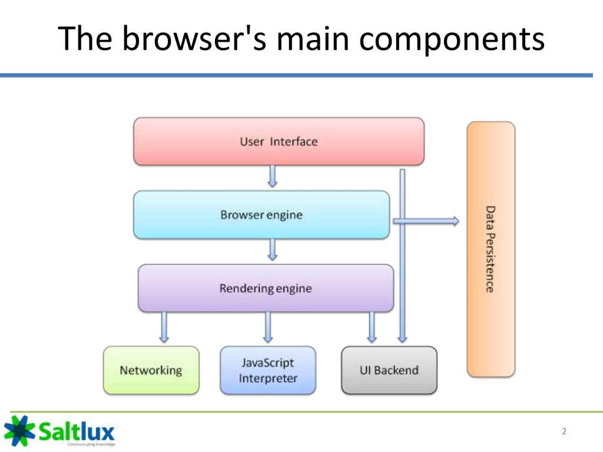
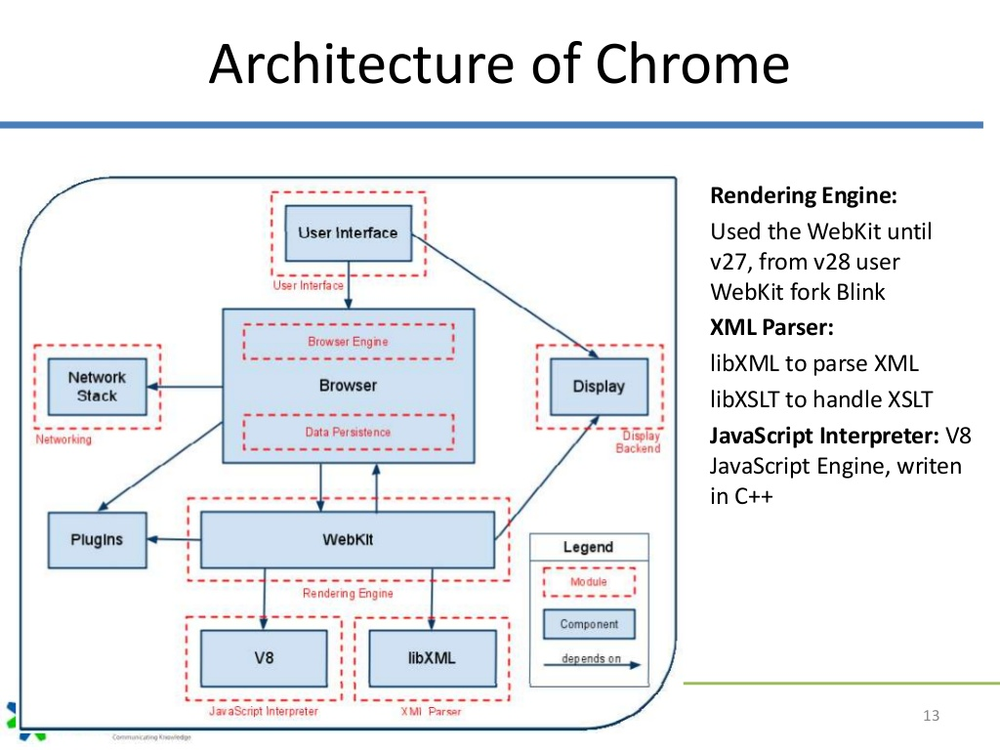
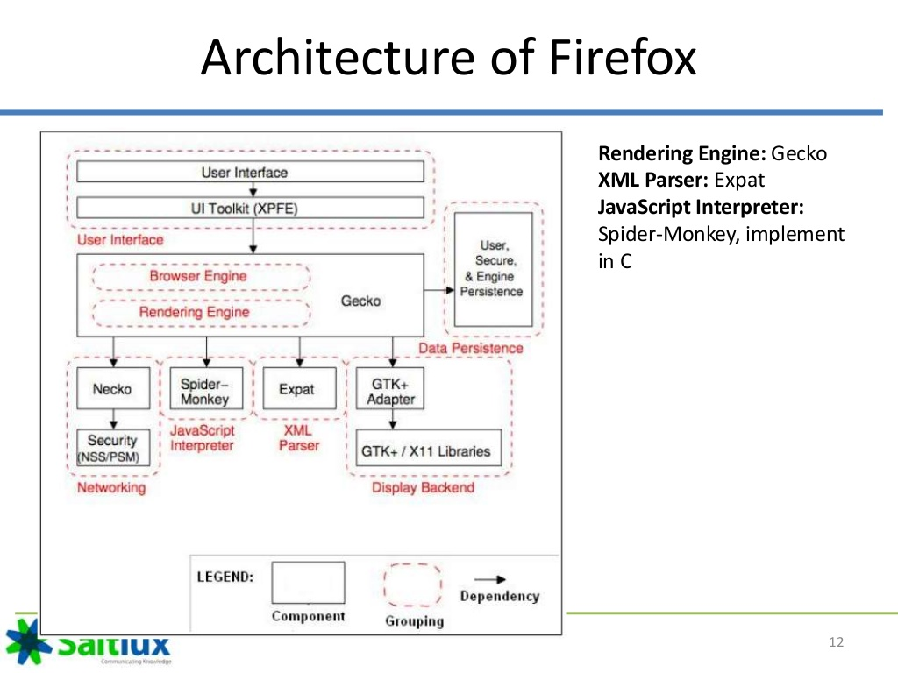
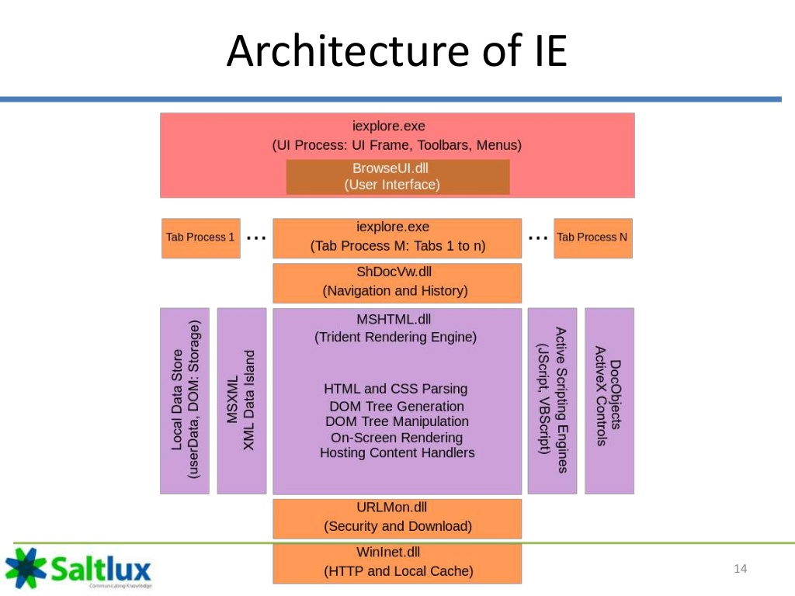
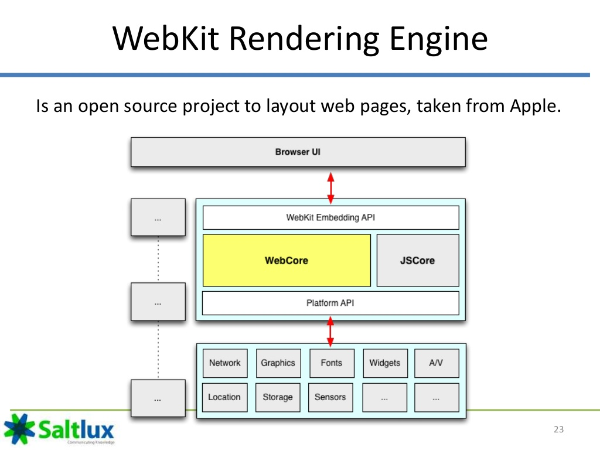
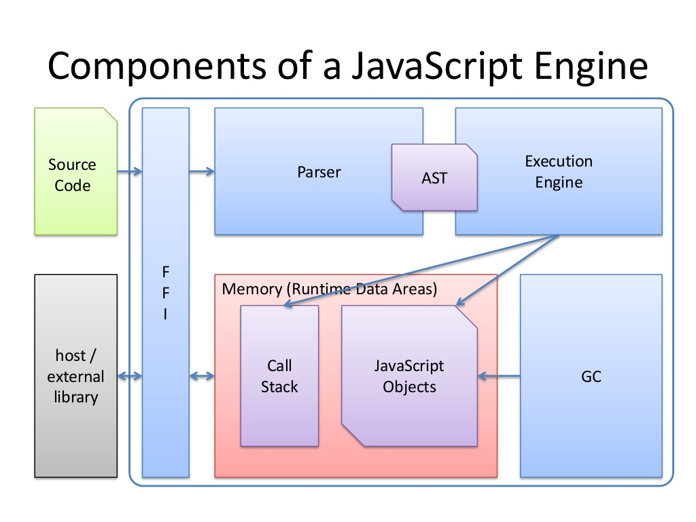
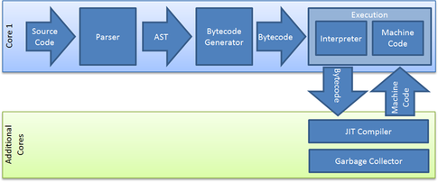
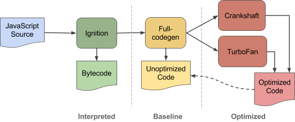

// build_options: 
Browser architecture
====================
Arnauld Van Muysewinkel <avm@pendragon.be>
v0.0, 07-Dec-2016: Draft version
:backend: slidy
:data-uri:
ifdef::env-build[:icons: font]
:extension: adoc
//extension may be overriden by compile.sh
:imgwidth: 700
ifeval::["{extension}"!="pdf"]
:doctitle: Web Performance Tuning - {doctitle}
:lastpage: lastpage.adoc.include
endif::[]
:copyright: Creative-Commons-Zero (Arnauld Van Muysewinkel)

Content
-------

* <<_web_browser,Web Browser>>
** <<_chrome,Chrome>>
** <<_firefox,Firefox>>
** <<_internet_explorer,Internet Explorer>>
* <<_rendering_engine,Rendering Engine>>
** <<_blink_webkit,Blink (WebKit)>>
** <<_other_rendering_engines,Others>>
* <<_javascript_engine,JavaScript Engine>>
** <<_v8,V8>>
** <<_other_javascript_engines,Others>>

_(link:0.1-training_plan.html#_introduction[back to plan])_

References
----------

* A Reference Architecture for Web Browsers. Alan Grosskurth & Michael W. Godfrey. University of Waterloo. http://grosskurth.ca/papers/browser-refarch.pdf
* How Browsers Work - Part 1 - Architecture. Vineet Gupta. http://archive.li/YOGPn
* Web-Browser Architecture. Nguyen Quang. Saltlux. 2015-05. http://www.slideshare.net/quangntta/web-browser-architecture-49196378
* Mobile Browser Internals. (Understanding Blink Rendering Engine). Hyungwook Lee. Naver Labs. 2014-01. http://www.slideshare.net/HyungwookLee/mobilebrowserinternal-20140122
* Official blog of the V8 JavaScript engine. http://v8project.blogspot.be/
** V8 Release 5.6. 2016-12-02. http://v8project.blogspot.be/2016/12/v8-release-56.html
* Implementing a JavaScript Engine. Kris Mok. Azul Systems. 2013-11-10. http://www.slideshare.net/RednaxelaFX/implement-js-krystalmok20131110
* How Browsers Work: Behind the scenes of modern web browsers. Tali Garsiel & Paul Irish. HTML5 Rocks Tutorials. 2011-08-05. https://www.html5rocks.com/en/tutorials/internals/howbrowserswork/

Web Browser
-----------

Chrome
------

Firefox
-------

[[_internet_explore]]
Internet Explorer (pre-Edge)
----------------------------

Rendering Engine
----------------

image::images/Gecko_Overview_9.png[width="{imgwidth}"]

Blink (WebKit)
--------------

Other rendering engines
-----------------------

* Gecko (Firefox)
* Trident (Internet Explorer)
* EdgeHTML (Edge)
* WebKit (Safari)

JavaScript Engine
-----------------

JavaScript Engine
-----------------

V8
--

https://github.com/v8/v8/wiki/Design%20Elements
http://thibaultlaurens.github.io/javascript/2013/04/29/how-the-v8-engine-works/
http://stackoverflow.com/a/12987881/318354
http://websrv0a.sdu.dk/ups/SCM/slides/lecture_03_mads_ager.pdf

V8: Interpreter
---------------

https://github.com/v8/v8/wiki/Interpreter > https://docs.google.com/document/d/11T2CRex9hXxoJwbYqVQ32yIPMh0uouUZLdyrtmMoL44/edit?ts=56f27d9d#heading=h.6jz9dj3bnr8t[Design document]

V8: Compiler
------------

https://github.com/v8/v8/wiki/TurboFan
http://wingolog.org/archives/2011/07/05/v8-a-tale-of-two-compilers

V8: Ignition pipeline
---------------------

As of Dec-2016:

V9: Garbage Collector
---------------------

Orinoco (since V8 5.0, Chrome 50)

https://blog.risingstack.com/javascript-garbage-collection-orinoco/ +
http://v8project.blogspot.be/2016/04/jank-busters-part-two-orinoco.html

Other JavaScript engines
------------------------

* *Monkey (Gecko, Netscape/Mozilla/Firefox)
* Spidermonkey (legacy): first ever JavaScript engine
* TraceMonkey: first JIT compiler
* JägerMonkey: improvement of TraceMonkey, superseded by IonMonkey
* IonMonkey: current engine with Gecko
* Chakra (Trident, Internet Explorer)
* SquirrelFish (WebKit, Safari) (was: JavaScriptCore)

include::{lastpage}[]
