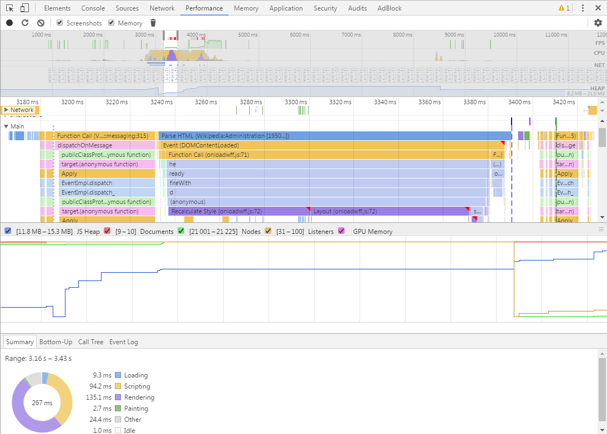

// build_options: 
Tuning transport issues
=======================
Arnauld Van Muysewinkel <avm@pendragon.be>
v0.2, 14-May-2017: Draft version
:backend: slidy
:data-uri:
ifdef::env-build[:icons: font]
:extension: adoc
//extension may be overriden by compile.sh
:imgwidth: 700
ifeval::["{extension}"!="pdf"]
:doctitle: Web Performance Tuning - {doctitle}
:lastpage: lastpage.adoc.include
endif::[]
:copyright: Creative-Commons-Zero (Arnauld Van Muysewinkel)
:boxtimes: &#8864;

Content
-------

* <<_axis,Most frequest improvement axis>>
* <<_investigation_tools,Investigation tools>>
* <<_pwa,Progressive Web Apps>>
* <<_http_2,HTTP/2>>
* <<_exercises,Exercises>>

_(link:0.1-training_plan.html#_transport[back to plan])_

[[_axis]]
Most frequent improvement axis
------------------------------

[cols="^",grid="none",frame="none"]
|=====
|image:images/fotolia_17151489_xs.jpg[width="{imgwidth}"]
|=====

Most frequent improvement axis
------------------------------

* Reduce HTTP requests count
* Use client-side processing
* (Parallelize requests)
* Use caches
* Reduce sizes
* (Use a Global Network, or CDN (Content Delivery network))
* Optimize depending on the context
* Reduce first rendering latency
* Optimize on the server side

Reduce HTTP requests count
--------------------------

* combine small images into one
* combine several scripts as one
* combine several stylesheet as one
* avoid duplicate (or useless!) scripts

Use client-side processing
--------------------------

* validations
* ...

//
//Parallelize requests
//--------------------
//

Use caches
----------

* +Expires+ header +
-> date/time after which the response is considered stale
* +ETag+ header +
-> identifier for a specific version of a resource
* make scripts and stylesheets external

Reduce sizes
------------

* minification of scripts and stylesheets
* compression of HTTP payload

Example: Angular.js

* minification: 729 KB -> 101 KB
* gzip compression: 101 KB -> 37 KB

(Use a Global Network)
----------------------

* CDN (Content Delivery Network or Content Distribution Network)
* globally distributed network of proxy servers deployed in multiple data centers

Goal: Serve content to end-users with:

* high availability
* high performance

Optimize depending on the context
---------------------------------

Context:

* device
* bandwidth

-> adapt size of resources (images) +
-> adapt complexity of page

Reduce first rendering latency
------------------------------

* stylesheets at the top
* scripts at the bottom

Optimize on the service side
----------------------------

* Reverse Proxy (offloading of some tasks)
* Load Balancer
* Cache static files
* Compress data
* Tune your backend (OS, middleware, application) -> see JPT course
* Monitoring

https://www.nginx.com/blog/10-tips-for-10x-application-performance/

Investigation tools
-------------------

* Timeline
* Boomerang
* Online tools
* Lighthouse

Timeline
--------

in Chrome: +
>> Developer Tools >> *Performance* >> (Record button)

Recording of:

* *FPS* (Frame Per Second) (60 fps = 16.67 ms / frame)
* *CPU* resources: shows what type of events consumed the CPU resources
* *NET*: each bar represents an HTTP resource. The longer the bar, the slower the request-response
** HTML files are blue.
** Scripts are yellow.
** Stylesheets are purple.
** Media files are green.
** Miscellaneous resources are grey.
* Paint events
* Screenshots
* Memory consumption (more on this later)
* JS Profile (more on this later)

https://developers.google.com/web/tools/chrome-devtools/evaluate-performance/timeline-tool

Timeline
--------

Boomerang
---------

Performance monitoring from the backend

* piece of javascript added to web pages
* measures the performance from end users point of view
* sends this data back to the server

https://yahoo.github.io/boomerang/doc/

Online tools
------------

Online application executing a number of predefined tests on a given web page.

Gives an overal evalution (/ 100 points) + detailed report with advices.

Only for applications visible publicly

https://developers.google.com/speed/pagespeed/insights

Lighthouse
----------

* Chrome extension: +
  https://github.com/GoogleChrome/lighthouse

-> verify criterias defined by the PWA specification (see further),
and give a global evaluation (/ 100 points) + detailed report with advices

[[_pwa]]
Progressive Web Apps (PWA)
--------------------------

*-> Bring user experience of native apps to web apps*

This is made possible by modern web technologies

According to Google, they must have the following characteristics:

progressive - responsive - work offline - app-like - fresh - safe -
discoverable - re-engageable - installable - linkable

https://developers.google.com/web/progressive-web-apps/

HTTP/2
------

Reduce latencies through:

* Data compression of HTTP headers
* HTTP/2 Server Push
* Pipelining of requests
* Multiplexing multiple requests over a single TCP connection

-> a number of current practices should disappear

Other topics
------------

* Guidelines REST (cf site SOA)

[[_exercises]]
Exercise: Elements order
------------------------

NOTE: Disable the cache for this exercise: Developer Tools >> Network >> {boxtimes} Disable cache

[source,html]
.elementsOrder.html
-----
include::../js/elementsOrder.html[]
-----

* Open the file with Chrome
* Notice the display delay
* Perform a network profiling
* Locate the cause of the issue
* Find a solution
* Verify your solution

include::{lastpage}[]
