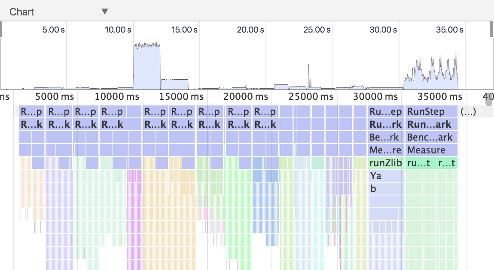
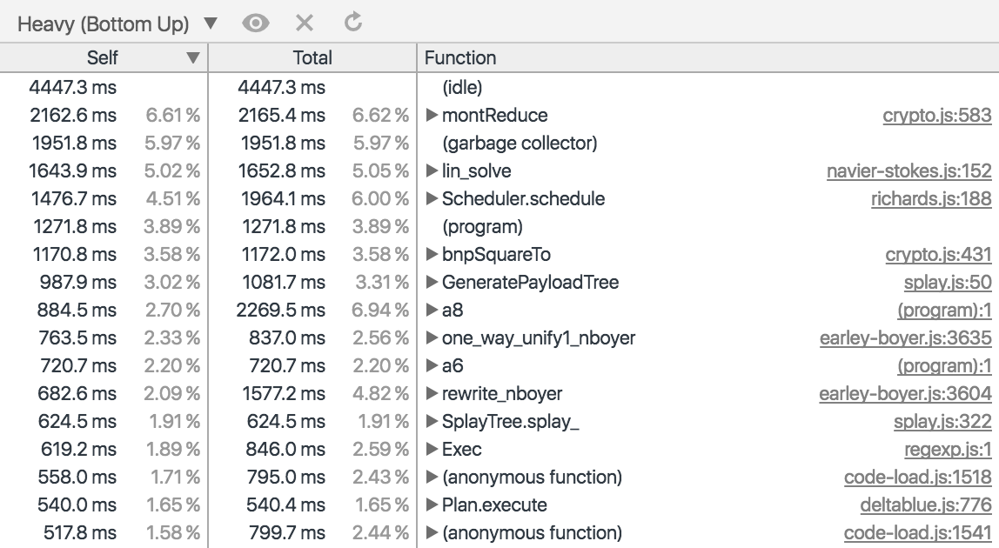
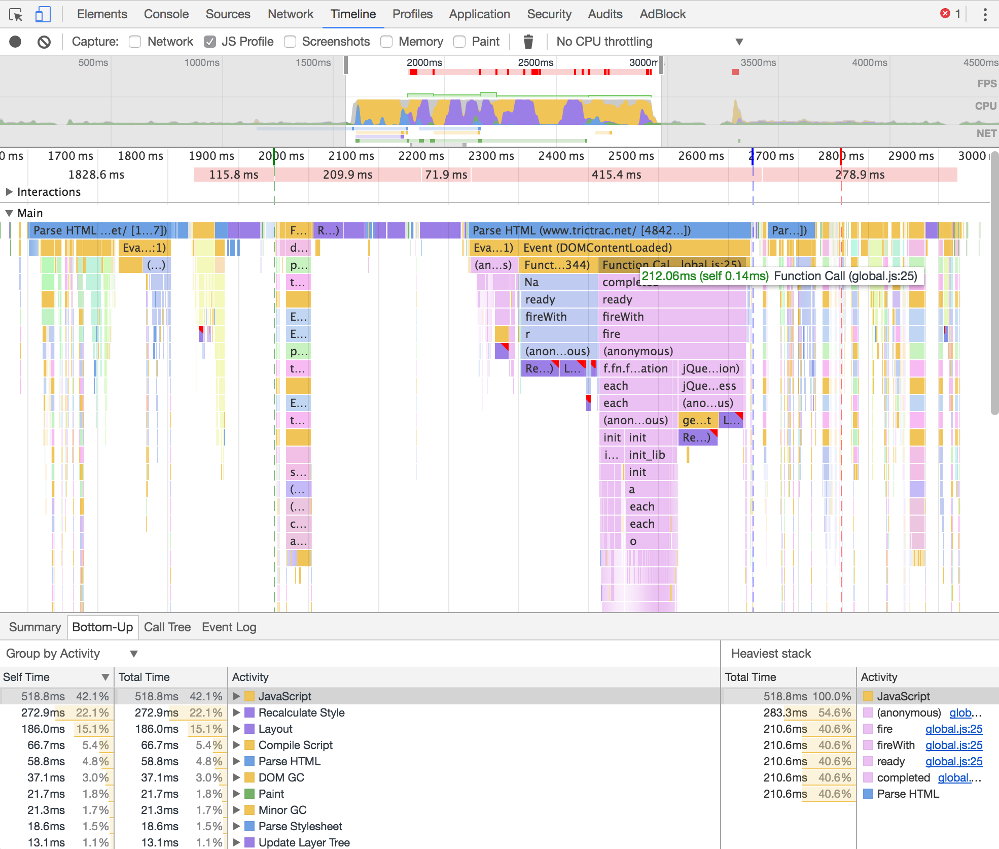

// build_options: 
CPU (compilation)
=================
Arnauld Van Muysewinkel <avm@pendragon.be>
v0.0, 07-Dec-2016: Draft version
:backend: slidy
:data-uri:
ifdef::env-build[:icons: font]
:extension: adoc
//extension may be overriden by compile.sh
:imgwidth: 700
ifeval::["{extension}"!="pdf"]
:doctitle: Web Performance Tuning - {doctitle}
:lastpage: lastpage.adoc.include
endif::[]
:copyright: Creative-Commons-Zero (Arnauld Van Muysewinkel)

Content
-------

* <<_causes,Typical causes of performance issues>>
* <<_profiling,Profiling>>

_(link:0.1-training_plan.html#_processing[back to plan])_

[[_causes]]
Typical causes of performance issues
------------------------------------

* Implementations
* Hidden classes
* Repetitions
* Generic API

Cause: Implementations
----------------------

Choose API methods carefully. There are often several ways of doing something,
but only one is most efficient.

For example, avoid:
[source,javascript]
-----
... = str.split("'").join("\'");
-----
prefer:
[source,javascript]
-----
... = str.replace(/'/g, "\'");
-----

Cause: Hidden classes
---------------------

* classes generated internally by V8 to represent each object type
* all objects created with the same members use the same hidden class
* => avoid changing the type (i.e. adding members) of an object after construction

[source,javascript]
-----
function Point(x, y) {
  this.x = x;
  this.y = y;
}

var p1 = new Point(11, 22);
var p2 = new Point(33, 44);
// At this point, p1 and p2 have a shared hidden class
p2.z = 55;
// warning! p1 and p2 now have different hidden classes!
-----

Cause: Repetitions
------------------

Avoid calling expensive objects in a loop.

Example: create a regular expression once, _before_ entering the loop

Avoid:
[source,javascript]
-----
function on(events, ...) {
  events = events.split(/\s+/);
  ...
}
-----

Prefer:
[source,javascript]
-----
var eventSplitter = /\s+/;
function on(events, ...) {
  events = events.split(eventSplitter);
  ...
}
-----

Cause: Generic API
------------------

More generic API's are usually slower.

For example, avoid:
[source,javascript]
-----
arr.slice(n)[0]
-----
prefer:
[source,javascript]
-----
arr[arr.length + n]
-----
(because +slice(n)+ makes a partial copy of the array into another array)

Causes...
---------

And many others...

Profiling
---------

* CPU profiling
* Timeline recording

CPU Profiler
------------

in Chrome: +
>> Developer Tools >> Profiles >> *{circleDot} Record JavaScript CPU Profile* >> (Record button)

Then, select "Chart" to get a _flame chart_.

Or, select "Heavy (Bottom Up)" to get histogram data.

CPU Profiler
------------

CPU Profiler
------------

Timeline recording
------------------

in Chrome: +
>> Developer Tools >> *Timeline >> {boxtimes} JS Profile* >> (Record button)

Same data as CPU Profiler, but in an integrated timeline view

Timeline recording
------------------

Other topics
------------

https://developers.google.com/web/tools/chrome-devtools/rendering-tools/ +
-> https://developers.google.com/web/tools/chrome-devtools/rendering-tools/js-execution +
-> https://developers.google.com/web/tools/chrome-devtools/evaluate-performance/timeline-tool#make-a-recording

Performance Issues and Optimizations in JavaScript: An Empirical Study.
Marija Selakovic and Michael Prade. Technical Report. TU Darmstadt, Department of Computer Science. 2015-Oct.
http://mp.binaervarianz.de/JS_perf_study_TR_Oct2015.pdf

Performance Tips for JavaScript in V8
https://www.html5rocks.com/en/tutorials/speed/v8/

https://developers.google.com/speed/articles/optimizing-javascript

// https: //youtu.be/N1swY14jiKc

Online tests:

* PageSpeed Insights https://developers.google.com/speed/pagespeed/insights/
* Mobile-Friendly Test https://search.google.com/search-console/mobile-friendly

Lower level languages
---------------------

* ASM.js - http://asmjs.org/
* WebAssembly - http://webassembly.org/

include::{lastpage}[]
